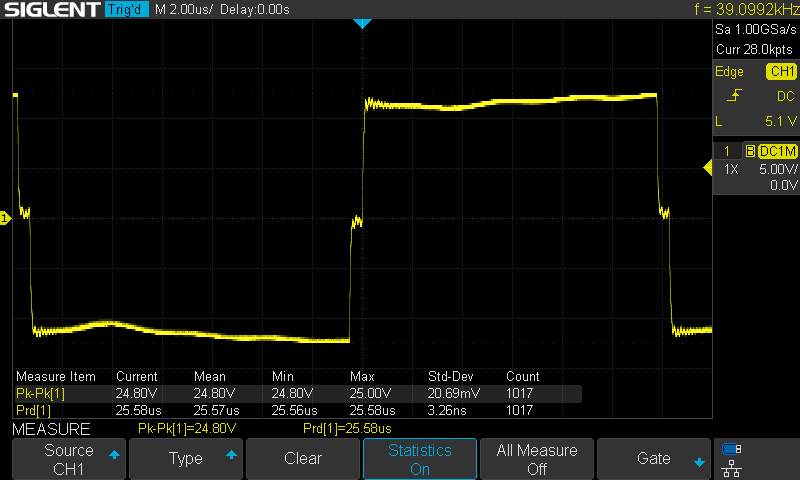
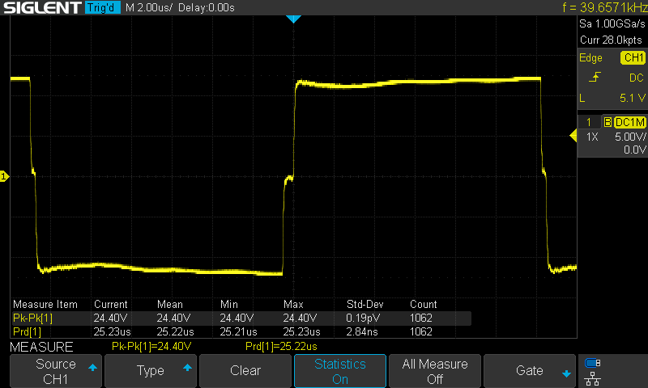

# Ultrasonic suspension soldering Kit firmware
 
This is a firmware to be programmed on the embeded STC15F104W, used in DIY ultrasonic soldiring kits you can find on banggood or ali express. The kit's manual is downloadable [here](https://m.media-amazon.com/images/I/A1v9YJLCl6L.pdf). The kit's PCB includes space for an ISP header at J2.

My goal was to check if small changes in the ultrasonic frequency are possible, and to what extent.

It uses platformio to compile and upload the firmware. See the platformio.ini file for specific parameters.
## Hardware needed
To upload the program in the microcontroler, you need an USB to TTL UART adapter, and a switch to reset the MCU when flashing, such as described in this [youtube video](https://youtu.be/uuZZEVhCWIg?si=PVHfgXFxWOHiAKNO&t=233)

## Timings
This firmware drives the ultrasonic transducers at 39.65 kHz, where the original chip achieves 39.01kHz (see sceen captures below)

It should be possible to be more accurate using timers or a faster clock, I did not try yet. Curently the frequency is OK to be able to levitate small beads, just as the original.

## Documentation
+ [Ultrasonic kit manual](https://m.media-amazon.com/images/I/A1v9YJLCl6L.pdf)
+ [STC15F104W Features & Datasheet](https://www.stcmicro.com/stc/stc15f104w.html)