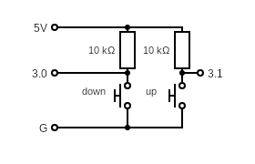
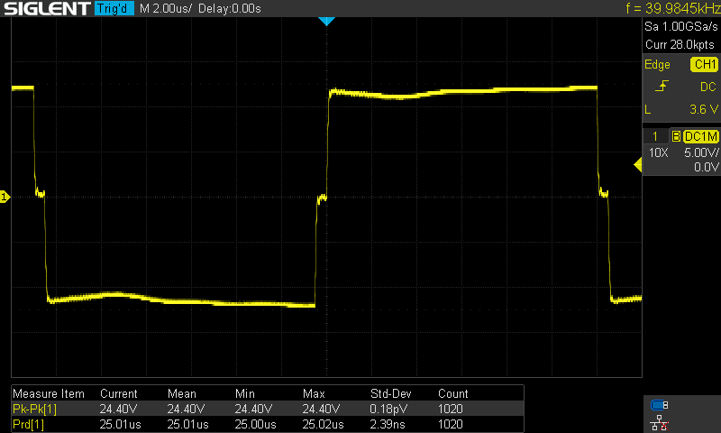

# Ultrasonic suspension soldering Kit firmware
 
This is a firmware to be programmed on the embeded STC15F104W, used in DIY ultrasonic soldiring kits you can find on banggood or ali express. The kit's manual is downloadable [here](https://m.media-amazon.com/images/I/A1v9YJLCl6L.pdf). The kit's PCB includes space for an ISP header at J2.

My goal was to check if small changes in the ultrasonic frequency are possible, and to what extent.

It uses platformio to compile and upload the firmware. See the platformio.ini file for specific parameters.
## Hardware needed
To upload the program in the microcontroler, you need an USB to TTL UART adapter, and a switch to reset the MCU when flashing, such as described in this [youtube video](https://youtu.be/uuZZEVhCWIg?si=PVHfgXFxWOHiAKNO&t=233)

## Optional frequency control
You can use the J2 connector to add 2 buttons: 
+ one between P3.1 and GND will be used to raise the frequency 
+ one between P3.0 and GND will be used to lower the frequency

You can omit the two 10k pull-up resistors and just connect the push buttons between input and GND, relying on the chip's internal pull-ups.

Each press of a button will briefly turn the LED down to acknowledge, and increment or decrement the frequency divider by one step. The clock is set at 12MHz and the initial divider value is 150, setting the half period to 12.5 micro seconds (150 counts at 12 MHz).

## Timings
This firmware drives the ultrasonic transducers at 39.98 kHz, where the original chip achieves 39.01kHz (see screen captures below)

This frequency is OK to be able to levitate small beads, just as the original. You can adjust the frequency with the up and down buttons, and check the output on an oscilloscope, and/or the current consumption on the 12V input. At he highest current consuption, you should be at the transducer's resonnant frequency and achive maximum effect.

## Documentation
+ [Ultrasonic kit manual](https://m.media-amazon.com/images/I/A1v9YJLCl6L.pdf)
+ [STC15F104W Features & Datasheet](https://www.stcmicro.com/stc/stc15f104w.html)
+ [STC15F101E Series MCU Datasheet](https://www.stcmicro.com/datasheet/STC15F100-en.pdf)